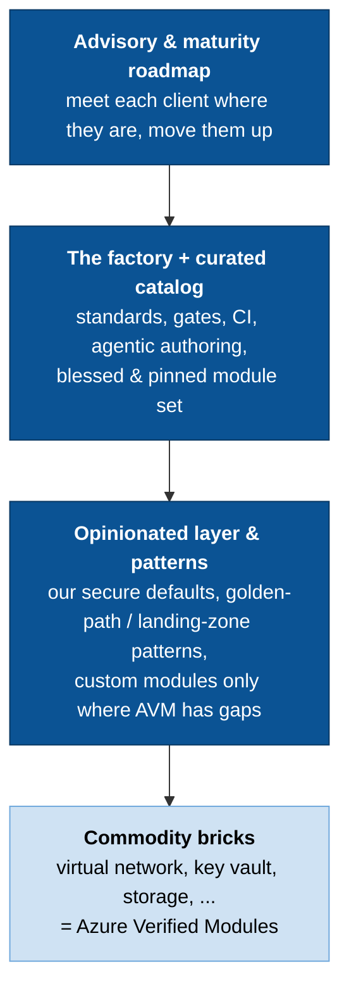
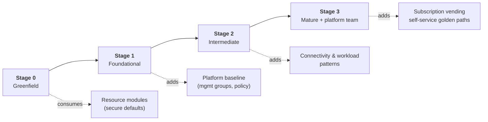

# The concept

> **In one minute.** This repo is a **factory for Azure infrastructure modules** — a
> repeatable system that turns Microsoft's free, supported [Azure Verified Modules
> (AVM)](https://azure.github.io/Azure-Verified-Modules/) into a **curated, opinionated,
> client-ready catalog**, and produces the few custom modules AVM is missing to the same
> standard. We **don't rebuild the commodity bricks** Microsoft already maintains. We build
> the layer on top that encodes *our* judgment — secure defaults, golden-path patterns,
> governance — and we deliver it to multiple enterprise clients from **one shared source**,
> each client pinning the versions and maturity tier that fit them.

The product is the **factory and the curation**, not the individual modules. That distinction is the whole idea.

---

## The problem we're solving

Every enterprise Azure engagement re-answers the same questions: *How do we get reusable,
secure, well-tested infrastructure modules? Who maintains them as the provider drifts? How
do we avoid each team/squad reinventing a virtual network for the fifth time?*

The naive answer — "we'll write our own module library" — is a trap:

- You end up **competing with free.** Microsoft now ships AVM: official, Well-Architected,
  supported modules for most Azure resources. Hand-rolling a `virtual_network` module means
  maintaining, forever, something Microsoft maintains better and gives away.
- You **own the maintenance treadmill.** Provider APIs change every few weeks. Multiply that
  across every module × every client.
- It **looks like lock-in.** A risk reviewer at an enterprise client is *more* comfortable
  with "built on Microsoft's Verified Modules" than "the consultant's bespoke modules."

## The core idea: a curated factory on top of AVM

We move our effort **up the value stack**. We *consume* the commodity layer and *build* the
layers that actually carry judgment and differentiation.



**Blue = what we build and sell. Light = what Microsoft maintains and we consume.**

## "Build, or use AVM?" — both. Here's the split

This is the question that causes confusion. The answer is that *use* and *build* happen at
different layers:

| We **USE** (consume, don't maintain) | We **BUILD** (this is the value) |
|---|---|
| AVM **resource modules** (`avm-res-*`) — vnet, key vault, storage, etc. | The **factory**: standards, the `make check` gate, CI, the agentic authoring loop |
| AVM **pattern modules** (`avm-ptn-*`) — platform landing zone, subscription vending | A **curated catalog**: which AVM modules are blessed, pinned, and secure-defaulted per client |
| Microsoft's support, telemetry, WAF-alignment, lifecycle | **Thin wrappers** that apply *our* opinions and simplify the interface |
| | **Custom modules** only where AVM has a genuine gap |
| | **Golden-path patterns** that compose AVM into client-shaped landing zones |
| | **Advisory**: the maturity roadmap that moves a client up the ladder |

> **The rule that falls out of this:** don't wrap an AVM resource module 1:1 just to add a
> thin layer — that's a maintenance treadmill with little value. Wrap where we add *real*
> value: (a) opinionated secure-defaults/simplified interface, (b) composite **pattern**
> modules, (c) genuine gaps. For pure pass-through resources, a catalog entry that pins the
> blessed AVM version + ships an example beats a hand-maintained wrapper.

## Why this is better business (the client value)

| Axis | Hand-roll our own modules | Curated factory on AVM |
|---|---|---|
| **Time-to-value** | Weeks to build a baseline | Days — the bricks exist; we assemble & opinionate |
| **Maintenance / TCO** | We (and each client) own provider drift forever | Microsoft maintains the bricks; we maintain thin wrappers |
| **Risk review / trust** | "Bespoke consultant modules" — scrutinised | "Built on Microsoft's official Verified Modules" — trusted |
| **Lock-in perception** | High — client depends on us | Low — and *that makes us more hireable*, not less |
| **Repeatability / margin** | Re-solve per client | Build the method once, deploy to 4 clients, tune per client |

This is why the AVM-wrap decision is recorded as a first-class architecture decision:
[ADR 0005 — wrap/curate AVM](adr/0005-wrap-curate-avm.md).

## Serving 4 clients at different maturity — from one source

Our four clients are all on Azure but at **different landing-zone maturity stages**.
Microsoft explicitly endorses graduated adoption — organisations implement *"all, some, or
none"* of centralised platform services
([CAF Ready](https://learn.microsoft.com/en-us/azure/cloud-adoption-framework/ready/)). That
is exactly what lets **one shared catalog** serve a greenfield team and a mature
platform-team simultaneously: each client adopts the **module categories** and **version
pins** that fit their stage — they don't get their own fork.



The full table — which client consumes what, mapped to the AVM modules we wrap — is the
[adoption maturity map](adoption-maturity-map.md). It's the artifact you put in front of a
client to show them where they are and what's next.

## How we keep quality high (the harness)

The factory is only credible if every module meets a hard, consistent bar. That's the
engineering harness this repo was originally built around: **one binary gate**
(`make check MODULE=<name>` = format, validate, lint, security scan, docs check, unit
tests, examples), a credential-free local loop, and CI that runs the identical checks.
A coding agent (Claude Code) authors modules *against that gate*, so quality is enforced by
machines, not memory. Full design: [docs/harness.md](harness.md).

The harness is what makes "wrap AVM and add our opinion" **fast and safe to repeat** — it's
the engine of the factory.

## Where we are today (honest current state)

- ✅ **The harness works end-to-end** — gates, CI, per-module versioning, agentic authoring,
  governance hooks. Proven by the `virtual-network` reference module, which currently builds
  from raw `azurerm` resources.
- 🔜 **Next: re-anchor to AVM.** `virtual-network` is the *v1 proof* that the factory
  produces senior-grade modules. The strategic direction ([ADR 0005](adr/0005-wrap-curate-avm.md))
  is that new modules **wrap a pinned AVM module by default**; the skeleton and `/new-module`
  workflow will be updated to scaffold the wrap pattern.
- 🔜 **Catalog, maturity map, and platform/vending wrappers** — see the
  [enhancement roadmap](enhancement-roadmap.md).

> The demo narrative writes itself: *"We've proven the factory builds modules to a senior
> standard. Now we point it at Microsoft's Verified Modules so we stop maintaining commodity
> code and focus on the opinion, the patterns, and the advisory — and we serve every client
> from one curated source."*

## Suggested 5-minute demo walkthrough

1. **The why (1 min)** — open this page; state the problem (don't compete with free; don't
   own the maintenance treadmill) and the idea (curated factory on AVM).
2. **The value stack (1 min)** — the diagram above: we *use* the bricks, we *build* the
   opinion + patterns + advisory.
3. **Show the bar is real (1.5 min)** — run it live:
   ```sh
   make check MODULE=virtual-network
   ```
   Point out it's one binary gate (fmt → validate → lint → security → docs → tests →
   examples), credential-free, identical in CI. *This* is why the factory is trustworthy.
4. **Show the governance (1 min)** — [ADR 0005](adr/0005-wrap-curate-avm.md) (we record
   strategic decisions) and [standards/](../standards) (every rule is a machine-checked gate).
5. **The client story (30 s)** — the [maturity map](adoption-maturity-map.md): one source,
   four clients, each at their own stage.
6. **The ask** — agree the direction (wrap AVM, build for gaps) and prioritise the
   [roadmap](enhancement-roadmap.md).

---

## Sources

The strategy is grounded in current (2025–2026) first-party Microsoft guidance, fact-checked
in the research behind [the roadmap](enhancement-roadmap.md):

- [Azure Verified Modules](https://azure.github.io/Azure-Verified-Modules/) — the standard; [lifecycle](https://azure.github.io/Azure-Verified-Modules/specs/shared/module-lifecycle/), [support](https://azure.github.io/Azure-Verified-Modules/help-support/module-support/), [telemetry](https://azure.github.io/Azure-Verified-Modules/help-support/telemetry/)
- [Terraform Verified Modules index — archived, consolidated into AVM (Jun 2026)](https://github.com/Azure/terraform-azure-modules)
- [CAF Ready: landing zones](https://learn.microsoft.com/en-us/azure/cloud-adoption-framework/ready/) and [implementation options](https://learn.microsoft.com/en-us/azure/cloud-adoption-framework/ready/landing-zone/implementation-options)
- [Azure Landing Zones IaC accelerator (built on AVM)](https://azure.github.io/Azure-Landing-Zones/accelerator/)
- [Subscription vending](https://learn.microsoft.com/en-us/azure/cloud-adoption-framework/ready/landing-zone/design-area/subscription-vending)
